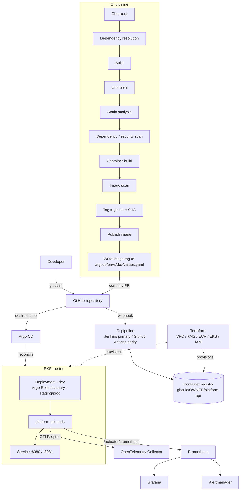
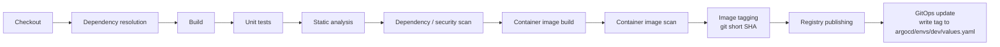
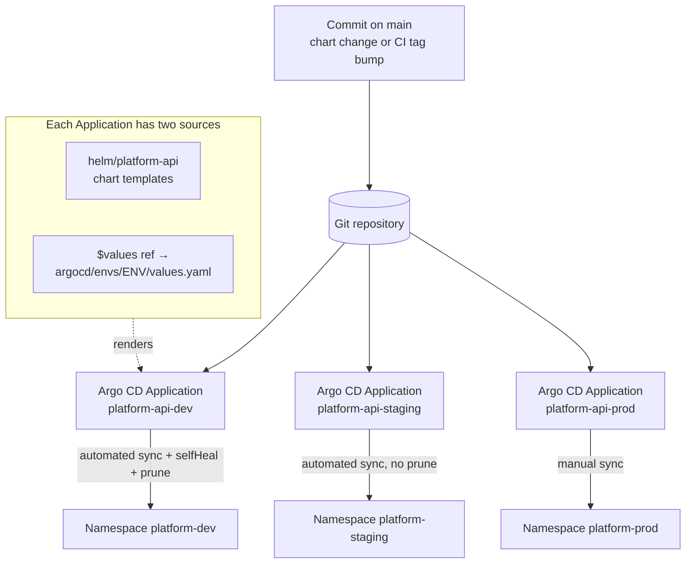
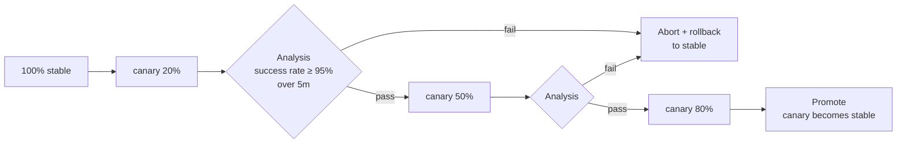

# kubernetes-platform-gitops

A production-grade reference implementation of a modern Kubernetes application delivery
platform: CI to container registry to GitOps to Argo CD to EKS, with progressive delivery,
observability, and security wired in from the start.

`OWNER` throughout the repository (`ghcr.io/OWNER/platform-api`,
`https://github.com/OWNER/kubernetes-platform-gitops.git`) is a placeholder — replace it
with your GitHub user or organisation.

---

## Table of contents

1. [Project overview](#1-project-overview)
2. [The engineering problem](#2-the-engineering-problem)
3. [Architecture](#3-architecture)
4. [Technology stack](#4-technology-stack)
5. [Repository structure](#5-repository-structure)
6. [CI/CD workflow](#6-cicd-workflow)
7. [GitOps workflow](#7-gitops-workflow)
8. [Kubernetes architecture](#8-kubernetes-architecture)
9. [Progressive delivery](#9-progressive-delivery)
10. [Security architecture](#10-security-architecture)
11. [Observability architecture](#11-observability-architecture)
12. [Terraform architecture](#12-terraform-architecture)
13. [Configuration model](#13-configuration-model)
14. [Troubleshooting](#14-troubleshooting)
15. [Future improvements](#15-future-improvements)

---

## 1. Project overview

The platform takes a commit and delivers it to Kubernetes using current platform-engineering
practice:

- **Continuous integration** — a Jenkins pipeline as the primary implementation and a
  GitHub Actions workflow at parity.
- **Immutable container images** published to a registry and identified by git commit SHA.
- **GitOps** — the desired state of every environment lives in this repository; Argo CD
  reconciles each cluster to match it. No human or CI job applies manifests to a cluster
  directly.
- **Progressive delivery** — `staging` and `prod` roll out with an Argo Rollouts canary
  gated by Prometheus analysis; `dev` uses a plain Deployment for fast feedback.
- **Infrastructure as code** — modular Terraform for the AWS substrate (VPC, KMS, ECR, EKS,
  IAM) with per-environment compositions.
- **Observability** — Prometheus metrics, alerting rules, a Grafana dashboard, and an
  OpenTelemetry Collector configuration.
- **Security** — non-root hardened containers, Kubernetes RBAC and NetworkPolicies,
  least-privilege IAM with IRSA, external secret management, and image/dependency scanning
  in the pipeline.

The workload, [`platform-api`](app/), is a deliberately small Spring Boot service. It exists
to give the platform something realistic to deliver; this is a **platform** project, not an
application project.

### The application

| Endpoint | Port | Purpose |
|---|---|---|
| `GET /api/v1/health` | 8080 | Human/load-balancer courtesy health string |
| `GET /api/v1/info` | 8080 | Build and environment metadata from configuration |
| `GET /api/v1/items` | 8080 | Lists in-memory seed data (no database) |
| `GET /actuator/health/liveness` | 8081 | Kubernetes liveness probe |
| `GET /actuator/health/readiness` | 8081 | Kubernetes readiness / startup probe |
| `GET /actuator/prometheus` | 8081 | Prometheus scrape endpoint |

Configuration is entirely environment-variable driven. Logs are structured JSON. There is no
persistent state.

---

## 2. The engineering problem

Teams shipping services to Kubernetes repeatedly have to answer the same questions:

- How does a commit become a running, verified, attributable artifact — without a human
  running `docker push` or `kubectl apply`?
- How is "what is supposed to be running in production" recorded, reviewed, and audited?
- How does a risky change reach production gradually, with an automatic, metric-based
  decision to continue or roll back?
- How is the AWS substrate created reproducibly, with encryption and least-privilege access,
  and kept separate per environment?
- How do operators see request rate, latency, errors, and saturation, and get paged before
  users notice?
- How are containers, dependencies, cluster permissions, network paths, and secrets kept to
  least privilege?

This repository answers each of those with concrete, consistent configuration rather than
prose, so the whole delivery path can be read end to end.

---

## 3. Architecture



The flow, in words:

1. A developer pushes to GitHub.
2. CI builds and verifies the service, scans dependencies and the image, tags the image with
   the 7-character git short SHA, and publishes it.
3. CI's final stage writes that tag into `argocd/envs/dev/values.yaml` and commits it.
   Promotion to `staging` and `prod` is a pull request that copies the tag forward.
4. Argo CD reconciles the target namespace to the desired state defined by the Helm chart
   plus the environment's override values.
5. In `dev` the workload is a `Deployment`. In `staging` and `prod` it is an Argo `Rollout`
   that shifts traffic to the new version in steps, checking a Prometheus success-rate query
   between steps and rolling back automatically if it fails.
6. Prometheus scrapes the management port; Grafana and Alertmanager consume that data. The
   OpenTelemetry Collector receives traces when the agent is enabled.

The AWS substrate (left, dashed) is defined in the Terraform modules under `terraform/`.

---

## 4. Technology stack

| Layer | Choice | Notes |
|---|---|---|
| Language / framework | Java 21, Spring Boot 3.5.x | Kept intentionally small — the platform is the focus |
| Build | Maven + Maven Wrapper | Script-only wrapper, no committed jar |
| Container | Docker, multi-stage | `maven:3.9-eclipse-temurin-21` build, `eclipse-temurin:21-jre-jammy` runtime, non-root UID 10001 |
| CI (primary) | Jenkins declarative pipeline | 11 named stages, credentials via Jenkins credential bindings |
| CI (parity) | GitHub Actions | Same stages; GHCR publish; optional AWS OIDC path for ECR |
| Registry | GHCR (`ghcr.io/OWNER/platform-api`) | ECR is the documented AWS-path swap |
| Packaging | Helm | `helm/platform-api` — the single source of truth for workload manifests |
| GitOps | Argo CD | `AppProject` + per-env multi-source `Application`s + app-of-apps |
| Progressive delivery | Argo Rollouts | Canary + `AnalysisTemplate` (Prometheus) in staging/prod |
| IaC | Terraform | Modules: `vpc`, `kms`, `ecr`, `eks`, `iam`; per-env compositions |
| Cloud | AWS: VPC, KMS, ECR, EKS, IAM/IRSA | Modular, per-environment; encryption and least-privilege by default |
| Metrics | Prometheus + Micrometer | Scrape `/actuator/prometheus` on port 8081 |
| Dashboards | Grafana | Dashboard model in `observability/grafana/` |
| Alerts | Prometheus rules / Alertmanager | `observability/prometheus/rules/` and the chart `PrometheusRule` |
| Tracing | OpenTelemetry | Java agent + Collector config; opt-in |
| Ingress | ingress-nginx | ALB documented as the AWS alternative |
| Secrets | External Secrets Operator → AWS Secrets Manager | Plus a SOPS note; no secret values in Git |
| Supply chain | Trivy — container image scan and dependency (filesystem) scan | Wired into both pipelines |

---

## 5. Repository structure

```
app/            Spring Boot service `platform-api` (Maven, in-memory data, actuator)
docker/         Dockerfile — multi-stage, non-root, layered jar
ci/             Jenkinsfile — primary CI pipeline (11 stages)
.github/        GitHub Actions workflow — CI parity
helm/           platform-api Helm chart — single source of truth for workload manifests
argocd/         AppProject, per-env Applications, app-of-apps, per-env override values
rollouts/       progressive-delivery docs + one labelled standalone example Rollout
k8s/            cluster bootstrap: namespaces, quotas, baseline RBAC, default-deny NetworkPolicy
terraform/      modular AWS IaC (vpc, kms, ecr, eks, iam) + per-env compositions
observability/  Prometheus rules, Grafana dashboard, OpenTelemetry Collector config
security/       container / Kubernetes / IAM / secrets / RBAC / scanning configs
scripts/        build, image scan, GitOps tag bump, lint, cross-file consistency check
docs/           architecture and workflow documentation
```

The split that matters: **the Helm chart renders every workload object** (Deployment or
Rollout, Services, Ingress, ConfigMap, ServiceAccount, Role, RoleBinding, HPA, PDB,
NetworkPolicy, and the gated ServiceMonitor / PrometheusRule / AnalysisTemplate /
ExternalSecret). `k8s/` holds only cluster/namespace governance that must exist before the
chart is applied. No workload manifest is defined in two places.

---

## 6. CI/CD workflow

Jenkins (`ci/Jenkinsfile`) is the primary pipeline. GitHub Actions
(`.github/workflows/ci.yml`) mirrors it. Both call the same helper scripts in `scripts/` so
the two stay in step.



| # | Stage | What it does | Fails the build when |
|---|---|---|---|
| 1 | Checkout | Clones the commit; computes the 7-char short SHA | — |
| 2 | Dependency resolution | `./mvnw -B -ntp dependency:go-offline` | Dependencies cannot be resolved |
| 3 | Build | `./mvnw -B -ntp -DskipTests package` | Compilation fails |
| 4 | Unit tests | `./mvnw -B -ntp test` | Any test fails |
| 5 | Static analysis | SpotBugs (`./mvnw -DskipTests verify -Pstatic-analysis`) | Quality gate not met |
| 6 | Dependency / security scan | `dependency:copy-dependencies` → Trivy filesystem scan of `app/target/deps` (ignore list `security/dependencies/.trivyignore`) | HIGH/CRITICAL with a fix, unignored |
| 7 | Container image build | `docker build -f docker/Dockerfile app/` | Build error |
| 8 | Container image scan | Trivy scan of the pushed image — HIGH/CRITICAL, `--ignore-unfixed`, ignore list `security/images/.trivyignore` | HIGH/CRITICAL with a fix, unignored |
| 9 | Image tagging | Tags `ghcr.io/OWNER/platform-api:<sha>` | — |
| 10 | Registry publishing | Pushes to GHCR using pipeline credentials | Auth / push error |
| 11 | GitOps update | `scripts/update-gitops-tag.sh` writes `.image.tag` in `argocd/envs/dev/values.yaml`, commits | Commit/push error |

Credentials (registry token, git bot token) are injected by the CI platform's credential
mechanism — `withCredentials` in Jenkins, encrypted secrets in Actions. Nothing is
hardcoded. The Actions workflow also includes an AWS OIDC path that publishes the image to
ECR; that job is off by default and is enabled together with the OIDC role
(`gha_oidc_enabled` in the `iam` Terraform module).

See [`docs/ci-cd.md`](docs/ci-cd.md).

---

## 7. GitOps workflow



- One `AppProject` (`platform`) constrains which repo, destinations, and resource kinds the
  Applications may use — including the CRDs for Argo Rollouts, Prometheus Operator, and
  External Secrets.
- Each environment has an `Application` named `platform-api-<env>` that targets namespace
  `platform-<env>`. It is **multi-source**: the Helm chart at `helm/platform-api`, plus a
  `$values` reference to `argocd/envs/<env>/values.yaml` in the same repository.
  `releaseName: platform-api` is set so resource names are identical across environments.
- `targetRevision` is `HEAD` for every source; pin it to a tag or release for production.
- Reconciliation: Argo CD renders `helm template` with the merged values, diffs the result
  against the live namespace, and applies the difference. Sync behaviour differs by
  environment (automated for dev/staging, manual for prod) to model a real confidence
  gradient.
- **Promotion** is a git operation: CI advances `dev`; a reviewer opens a PR copying the
  tested image tag into `argocd/envs/staging/values.yaml`, then `prod`.

See [`docs/gitops.md`](docs/gitops.md).

---

## 8. Kubernetes architecture

Everything below is rendered by the Helm chart unless noted.

| Object | Notes |
|---|---|
| `Deployment` **or** `Rollout` | `Deployment` when `argoRollouts.enabled: false` (dev); `Rollout` otherwise (staging/prod). Same pod template. |
| `Service` `platform-api` | Ports `http` (8080) and `management` (8081). Stable service under canary. |
| `Service` `platform-api-canary` | Rendered only under canary; target for progressive traffic. |
| `Ingress` | `ingressClassName: nginx`; host per environment; TLS block gated (`ingress.tls.enabled`). |
| `ConfigMap` | Non-secret configuration; a checksum annotation on the pod template triggers a roll on change. |
| `ServiceAccount` `platform-api` | Carries the IRSA role-ARN annotation (empty by default). |
| `Role` + `RoleBinding` | Namespaced; grants `get`/`list` on the app's own ConfigMap only; gated `rbac.create`. |
| `HorizontalPodAutoscaler` | CPU + memory targets; `scaleTargetRef` kind follows the Rollouts toggle. |
| `PodDisruptionBudget` | `minAvailable` tuned so a canary step cannot violate it. |
| `NetworkPolicy` | Allows ingress-controller → 8080, monitoring → 8081, DNS egress; layered on `k8s/` default-deny. |
| `ServiceMonitor` | Gated (`serviceMonitor.enabled`); scrapes `management` / `/actuator/prometheus`. |
| `PrometheusRule` | Gated; the six alert rules. |
| `AnalysisTemplate` `platform-api-success-rate` | Gated with the Rollout; Prometheus success-rate query. |
| `ExternalSecret` | Gated (`externalSecrets.enabled`, default off); produces `platform-api-secrets`. |

Bootstrap objects in `k8s/` (applied once, before Argo CD takes over the namespace):
`Namespace` (`platform-<env>`, Pod Security Admission `restricted`), `ResourceQuota`,
`LimitRange`, baseline RBAC, and a default-deny `NetworkPolicy`.

### Pod hardening (chart defaults)

- `runAsNonRoot: true`, `runAsUser: 10001`, `runAsGroup: 10001`, `fsGroup: 10001`
- `readOnlyRootFilesystem: true` with an `emptyDir` at `/tmp`
- `allowPrivilegeEscalation: false`, `capabilities.drop: ["ALL"]`
- `seccompProfile.type: RuntimeDefault`
- CPU/memory **requests and limits** set; overridable per environment
- `liveness`, `readiness`, and `startup` probes on port 8081
- `terminationGracePeriodSeconds` + `preStop` sleep, matched to the app's
  `server.shutdown: graceful` timeout
- `topologySpreadConstraints` across zone and hostname
- `RollingUpdate` strategy for the Deployment path; canary steps for the Rollout path

See [`docs/architecture.md`](docs/architecture.md).

---

## 9. Progressive delivery

`staging` and `prod` deploy through an Argo `Rollout` with a canary strategy:



- **Traffic progression**: default steps of 20% / 50% / 80% with pauses between, in
  `helm/platform-api/values.yaml` under `argoRollouts.steps`; `prod` overrides them with
  smaller steps and longer pauses.
- **Analysis**: an `AnalysisTemplate` named `platform-api-success-rate` runs a Prometheus
  query — the ratio of non-5xx to total `http_server_requests_seconds_count` for the canary
  — and requires it to stay above a threshold. `prometheusAddress` is a single values key
  (`http://prometheus-operated.monitoring.svc:9090`).
- **Promotion**: on passing the final step, the canary ReplicaSet becomes stable.
- **Rollback**: a failed analysis aborts the rollout and shifts all traffic back to the
  stable version automatically. Manual: `kubectl argo rollouts undo platform-api -n platform-<env>`.

`rollouts/example-rollout.yaml` is a standalone copy of the rendered Rollout for reading the
resource shape without Helm; the chart is what delivery uses.

See [`docs/progressive-delivery.md`](docs/progressive-delivery.md).

---

## 10. Security architecture

Defence in depth, expressed as configuration in `security/` and enforced by the chart and
pipeline:

| Domain | Control |
|---|---|
| Container | Multi-stage build, no build tools in the runtime image, non-root UID 10001, read-only root filesystem, all Linux capabilities dropped, `seccomp: RuntimeDefault`, no secrets baked in |
| Kubernetes workload | `restricted` Pod Security Admission, least-privilege namespaced RBAC, layered NetworkPolicies (default-deny + explicit allows), resource quotas and limits |
| Cluster access | RBAC principles and example roles in `security/rbac/`; no `cluster-admin` bindings |
| AWS IAM | Least-privilege policies in `terraform/modules/iam`; IRSA maps the `platform-api` ServiceAccount to a role via the cluster OIDC provider; GitHub Actions uses OIDC, not static keys |
| Secrets | External Secrets Operator pulls from AWS Secrets Manager into `platform-api-secrets`; SOPS documented for encrypted-in-Git manifests; no secret values committed |
| Supply chain — images | Trivy scan in both pipelines; ignore list in `security/images/.trivyignore` |
| Supply chain — dependencies | Trivy filesystem scan of the built jar in both pipelines; ignore list in `security/dependencies/.trivyignore` |
| Encryption | KMS customer-managed key (Terraform `kms` module) for ECR at rest and EKS secrets envelope encryption; S3 state bucket SSE |

See [`security/README.md`](security/README.md) and [`docs/security.md`](docs/security.md).

---

## 11. Observability architecture

The four SRE signals, plus saturation, mapped to concrete metrics:

| Signal | Metric(s) |
|---|---|
| Traffic | `rate(http_server_requests_seconds_count[5m])` |
| Latency | `histogram_quantile(0.95, sum by (le) (rate(http_server_requests_seconds_bucket[5m])))` |
| Errors | `sum(rate(http_server_requests_seconds_count{status=~"5.."}[5m])) / sum(rate(http_server_requests_seconds_count[5m]))` |
| Saturation | `tomcat_threads_busy_threads / tomcat_threads_config_max_threads`; `rate(container_cpu_cfs_throttled_periods_total[5m])` |
| CPU | `process_cpu_usage`, `container_cpu_usage_seconds_total` |
| Memory | `jvm_memory_used_bytes`, `container_memory_working_set_bytes` |
| Pod restarts | `kube_pod_container_status_restarts_total` (kube-state-metrics) |

- **Scrape**: a `ServiceMonitor` (chart, gated) or the static config in
  `observability/prometheus/scrape-config.example.yaml` points Prometheus at
  `:8081/actuator/prometheus`.
- **Alerts** (`observability/prometheus/rules/platform-api-alerts.yaml`, mirrored by the
  chart `PrometheusRule`): high error rate, high latency, crash-looping pods, high CPU, high
  memory, and unavailable replicas. The "unavailable replicas" rule has a Deployment variant
  (dev) and an Argo Rollouts variant (staging/prod).
- **Dashboard**: `observability/grafana/dashboards/platform-api.json` — traffic, latency
  percentiles, error ratio, JVM and container resource use, restarts, saturation, templated
  by namespace/environment.
- **Traces**: `observability/opentelemetry/collector.yaml` defines an OTLP gateway
  Collector. The application emits traces when the Java agent is enabled
  (`otel.enabled: true`); trace/span IDs are then included in the structured logs.

Assumes kube-prometheus-stack (Prometheus Operator + kube-state-metrics) is installed in a
`monitoring` namespace. See [`docs/observability.md`](docs/observability.md).

---

## 12. Terraform architecture

```
terraform/
  modules/
    vpc/     VPC, public + private subnets across AZs, NAT, flow logs
    kms/     customer-managed KMS key + alias (rotation enabled)
    ecr/     platform-api repository, scan-on-push, immutable tags, KMS encryption
    eks/     EKS cluster, managed node group, OIDC provider, control-plane SG, secrets envelope encryption
    iam/     IRSA role for platform-api, optional GitHub Actions OIDC role, least-privilege policies
  environments/
    dev/  staging/  prod/    versions.tf, backend.tf.example, variables.tf,
                             main.tf (locals + provider default_tags + module wiring),
                             outputs.tf, terraform.tfvars.example
```

- **Reusable modules** with explicit `variables.tf` / `outputs.tf` / `versions.tf`.
- **Locals** in each environment for the name prefix (`platform-<env>`) and the common tag
  set; applied both as `provider` `default_tags` and passed to modules.
- **Tagging**: `Project`, `Environment`, `ManagedBy`, `Owner` on every taggable resource.
- **Encryption**: KMS for ECR at rest and EKS secrets; S3 remote-state bucket SSE.
- **Least privilege**: narrow IAM policy documents; IRSA trust scoped to
  `system:serviceaccount:platform-<env>:platform-api`.
- **Remote state**: S3 bucket + DynamoDB lock table per the design in
  [`terraform/README.md`](terraform/README.md); the backend is supplied as
  `backend.tf.example` — copy it to `backend.tf` and set the bucket to enable remote state.
  State key: `platform/<env>/terraform.tfstate`.
- **Environment separation**: one directory per environment, one state file per environment,
  no shared mutable state.

No AWS credentials, account IDs, or account-numbered ARNs appear in the repository — ARNs are
built at plan time from `aws_caller_identity` / `aws_region`. See
[`docs/terraform.md`](docs/terraform.md) and [`docs/deployment.md`](docs/deployment.md).

---

## 13. Configuration model

Configuration is separated from the image at every layer:

| Layer | Mechanism | Example |
|---|---|---|
| Application | Environment variables bound to `@ConfigurationProperties` | `PLATFORM_INFO_ENVIRONMENT`, `PLATFORM_ITEMS_SEED_COUNT` |
| Container | JVM flags via `JAVA_TOOL_OPTIONS`; nothing environment-specific baked in | `-XX:MaxRAMPercentage=75` |
| Chart defaults | `helm/platform-api/values.yaml` | image, resources, probes, security context, toggles |
| Environment overrides | `argocd/envs/<env>/values.yaml` | replica count, resource sizing, ingress host, `argoRollouts.enabled`, image tag |
| Schema | `helm/platform-api/values.schema.json` | validates the merged (defaults + env) values |
| Secrets | `ExternalSecret` → `platform-api-secrets`, consumed via `envFrom` | never in Git |

The image is identical across environments; only values differ. The image **tag** is the
one value CI writes back into Git. `appVersion` (`0.1.0`) tracks the chart/app release and
is deliberately *not* bumped when only the image changes — the running version is the git
SHA, surfaced through the `app.kubernetes.io/version` label. See
[`docs/configuration.md`](docs/configuration.md).

---

## 14. Troubleshooting

Common symptoms and where to look; full detail in
[`docs/troubleshooting.md`](docs/troubleshooting.md).

| Symptom | Where to look |
|---|---|
| Argo CD app `OutOfSync` / `Degraded` | `argocd app diff platform-api-<env>`; chart render vs live; CRD present? |
| Pods `CrashLoopBackOff` | `kubectl logs`, `kubectl describe`; probe ports must be 8081; `/tmp` emptyDir present for read-only root fs |
| Rollout stuck | `kubectl argo rollouts get rollout platform-api -n platform-<env>`; AnalysisRun result; Prometheus reachable at the configured address |
| No metrics in Prometheus | ServiceMonitor label match; NetworkPolicy allows monitoring → 8081; scrape path `/actuator/prometheus` |
| Image pull failure | registry auth; tag exists; `image.repository` matches what CI published |
| Terraform drift / lock | remote-state bucket + DynamoDB lock; `terraform plan` per environment |
| Line-ending / `mvnw` failures on Linux | `.gitattributes` normalisation; exec bit — see `docs/troubleshooting.md` |

---

## 15. Future improvements

- Sigstore/cosign image signing and verification admission (Kyverno or Connaisseur).
- SLO definitions with multi-window multi-burn-rate alerting; error-budget policy.
- Custom-metrics HPA (RPS via Prometheus Adapter) alongside the CPU/memory targets.
- Progressive delivery for the `dev` path too, behind a flag, for parity.
- `terraform-aws-modules` adoption for VPC/EKS to reduce hand-maintained surface.
- Multi-region / multi-cluster Argo CD (ApplicationSet per cluster).
- Contract tests and a smoke-test AnalysisTemplate step before the first traffic shift.
- Policy-as-code in CI (Conftest/OPA) over the rendered manifests.
- Backstage or a similar catalog entry describing the service and its runbooks.

---

## Working with this repository

```bash
# Render the chart for each environment (needs helm)
helm lint helm/platform-api
helm template platform-api helm/platform-api -f argocd/envs/dev/values.yaml    # a Deployment
helm template platform-api helm/platform-api -f argocd/envs/prod/values.yaml   # a Rollout

# Cross-file consistency check
bash scripts/local-verify.sh

# Build and test the service (needs a JDK; the wrapper fetches Maven)
cd app && ./mvnw -B verify
```

Provisioning and first deployment are covered in [`docs/deployment.md`](docs/deployment.md).
The naming and version contract every file follows is in
[`docs/architecture.md`](docs/architecture.md).
