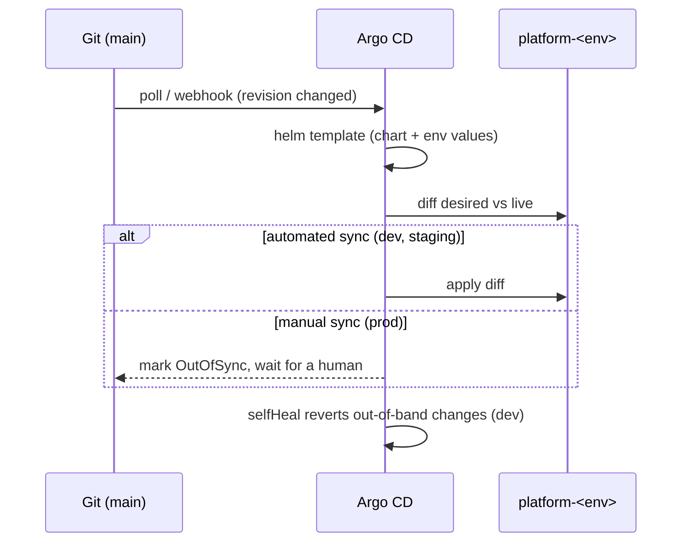

# GitOps workflow

The repository is the desired state. Argo CD reconciles each `platform-<env>` namespace to
match it. No human and no CI job runs `kubectl apply` against a cluster.

## Objects

| File | Object | Purpose |
|---|---|---|
| `argocd/projects/platform.yaml` | `AppProject` `platform` | allowed repo, destinations (`argocd` + `platform-{dev,staging,prod}`), and resource kinds (incl. the Rollouts / Prometheus Operator / External Secrets CRDs) |
| `argocd/apps/platform-api-<env>.yaml` | `Application` `platform-api-<env>` | one per environment, multi-source |
| `argocd/app-of-apps.yaml` | `Application` `platform-api` | syncs the three Applications above from `argocd/apps/` |
| `argocd/envs/<env>/values.yaml` | Helm values | per-environment overrides, including the CI-written `image.tag` |

## Multi-source Applications

Each `platform-api-<env>` Application has two sources:

1. the Helm chart at `path: helm/platform-api`, `targetRevision: HEAD`,
   `helm.releaseName: platform-api`;
2. the same repo again with `ref: values`, supplying
   `valueFiles: [$values/argocd/envs/<env>/values.yaml]`.

Argo CD renders `helm template` with chart defaults plus the env file, diffs against the
live namespace, and applies the difference. `releaseName: platform-api` keeps every rendered
resource name identical across environments; only the namespace differs.

## Reconciliation

## Sync policy gradient

| Env | automated | selfHeal | prune |
|---|---|---|---|
| dev | yes | yes | yes |
| staging | yes | yes | no |
| prod | no (manual sync) | — | — |

`CreateNamespace=false` everywhere — namespaces come from `k8s/` bootstrap with their PSA
labels and quotas.

## Promotion

1. CI builds on `main`, publishes `ghcr.io/OWNER/platform-api:<sha>`, and commits that
   `<sha>` into `argocd/envs/dev/values.yaml`. Argo CD rolls dev.
2. Once dev is healthy, open a PR copying the same `image.tag` into
   `argocd/envs/staging/values.yaml`. Merge → Argo CD rolls staging (canary).
3. After staging soak, PR the tag into `argocd/envs/prod/values.yaml`. Merge → prod shows
   `OutOfSync`; a human runs the sync (or clicks Sync) → prod canary begins.

## Argo CD tracking label

Set Argo CD's `application.instanceLabelKey` to `argocd.argoproj.io/instance`. The chart
uses `app.kubernetes.io/instance: platform-api-<env>` as part of its selector, so Argo CD
must track with its own label rather than overwriting `app.kubernetes.io/instance`.
